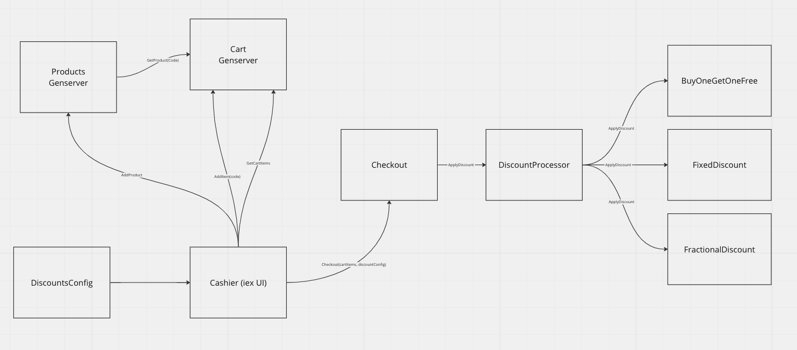

# Cashier

Versions:

elixir 1.14.5, erlang 26.0.1

Cashier is a very simple terminal tool that mimics a process of checkout in a supermarket. There's no graphical UI interface and can only be used through iex.

This diagram shows how the different modules interact with each other:



The cart and product state is stored in genserver processes for simplicity. There's no user identity built in.

### Usage

Run tests:

```
mix deps.get
mix test --cover
```

Use the cashier:

```
iex -S mix

ProductStore.add_product(%{code: "GR1", name: "Green Tea", price: 3_11})
ProductStore.add_product(%{code: "SR1", name: "Strawberries", price: 5_00})
ProductStore.add_product(%{code: "CF1", name: "Coffee", price: 11_23})

Example 1:

Cashier.clear_items()
Cashier.scan_item("GR1")
Cashier.scan_item("SR1")
Cashier.scan_item("GR1")
Cashier.scan_item("GR1")
Cashier.scan_item("CF1")

Cashier.print_totals()

Example 2:

Cashier.clear_items()
Cashier.scan_item("GR1")
Cashier.scan_item("GR1")

Cashier.print_totals()

Example 3:

Cashier.clear_items()
Cashier.scan_item("SR1")
Cashier.scan_item("SR1")
Cashier.scan_item("GR1")
Cashier.scan_item("SR1")

Cashier.print_totals()

Example 4:

Cashier.clear_items()
Cashier.scan_item("GR1")
Cashier.scan_item("CF1")
Cashier.scan_item("SR1")
Cashier.scan_item("CF1")
Cashier.scan_item("CF1")

Cashier.print_totals()
```

---

The Cashier.print_totals/1 function accepts an optional configuration, which you might use to change the rules applied to the discounts:

```
[
    %{
      product_code: "GR1",
      discount: BuyOneGetOne,
      minimum: 1
    },
    %{
      product_code: "SR1",
      discount: FixedDiscount,
      minimum: 3,
      deduct_amount: ~M[0_50]
    },
    %{
      product_code: "CF1",
      discount: TwoThirdsDiscount,
      minimum: 3
    }
  ]
  ```

  A rule can be applied to a product code, and some rules (such as FixedDiscount) have extra parameters as the deduct_amount. More products and rules can be added as needed.

  Important: for simplicity, only the first found rule per product_code will be applied, duplicates will be ignored.